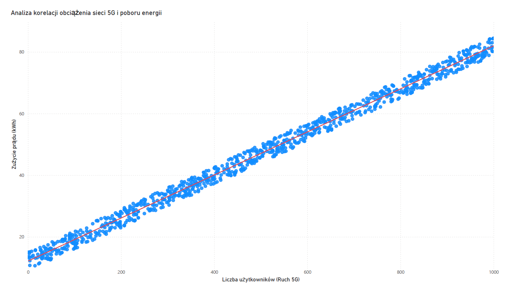

# 📡 5G Energy Consumption Prediction

Projekt optymalizacji zużycia energii w nadajnikach sieci 5G przy użyciu Sztucznej Inteligencji i analizy danych SQL.

## 🚀 O Projekcie
Głównym celem projektu jest przewidywanie zapotrzebowania na energię elektryczną przez nadajniki 5G w zależności od liczby aktywnych użytkowników. Pozwala to na lepsze zarządzanie zasobami energetycznymi w infrastrukturze telekomunikacyjnej.

## 🛠️ Architektura Rozwiązania
1. **Generowanie Danych (`data_generator.py`)**: Skrypt symulujący realne obciążenie sieci z uwzględnieniem szumu statystycznego.
2. **Ekstrakcja SQL (`data_extraction.sql`)**: Zapytanie łączące dane techniczne nadajników z pomiarami energii.
3. **Model AI (`predictive_model.py`)**: Implementacja regresji liniowej z wykorzystaniem biblioteki SymPy do obliczeń gradientowych.
4. **Wizualizacja**: Raport Power BI przedstawiający trendy zużycia.

## 📊 Wyniki Wizualne

## 💡 Technologie
* **Python** (SymPy, Pandas)
* **SQL**
* **Power BI**
